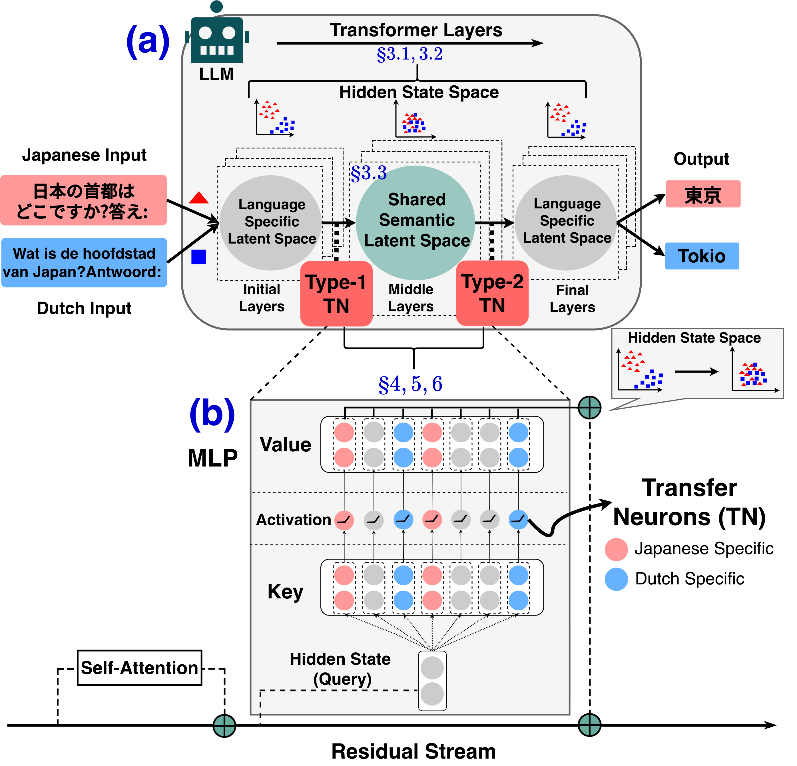

# The Transfer Neurons Hypothesis: An Underlying Mechanism for Language Latent Space Transitions in Multilingual LLMs.

Codes for the main results of the paper.  
paper: [ACL Anthology](https://aclanthology.org/2025.emnlp-main.1618/), [arXiv Preprint](https://arxiv.org/abs/2509.17030)

## Abstract
Recent studies have suggested a processing framework for multilingual inputs in decoder-based LLMs: early layers convert inputs into English-centric and language-agnostic representations; middle layers perform reasoning within an English-centric latent space; and final layers generate outputs by transforming these representations back into language-specific latent spaces.
However, the internal dynamics of such transformation and the underlying mechanism remain underexplored.
Towards a deeper understanding of this framework, we propose and empirically validate **The Transfer Neurons Hypothesis**: certain neurons in the MLP module are responsible for transferring representations between language-specific latent spaces and a shared semantic latent space.
Furthermore, we show that one function of language-specific neurons, as identified in recent studies, is to facilitate movement between latent spaces.
Finally, we show that transfer neurons are critical for reasoning in multilingual LLMs.
<p align="center">

</p>

## Set Up
Python version: ```Python 3.9.18```
```bash
# clone repo.
git clone https://github.com/HinaTezuka/emnlp2025-transfer-neurons.git
cd emnlp2025-transfer-neurons
# set up an emvironment.
python -m venv tn_detection
source tn_detection/bin/activate
pip install -r requirements.txt
```

## Transfer Neurons Detection
### Sentence Dataset Requirements
- L1: fixed to English (We assume English latent space serves as a shared semantic latent space in middle layers).
- L2: language you want to detect as transfer neurons (in the paper, we detected TNs for ja/nl/ko/it).
- For Type-1 neurons detection: data must be a list of parallel sentence pairs(tuple) of english-L2: ```[(L1_sentence1, parallel_sentence_in_L2), (L1_sentence2, parallel_sentence_in_L2), ...]```
- For Type-2 neurons detection: data must be a list of L2 sentences: ```[L2_sentence1, L2_sentence2, L2_sentence3, ...]```

You can use any sentence datasets as long as the datasets meet the conditions above.  
(In the paper, we used [tatoeba](https://huggingface.co/datasets/Helsinki-NLP/tatoeba) corpus.)

### Centroids Estimation
**example usage (for Type-1 neurons):**
```bash
python -m tn.calc_centroids_for_tn_detection \
    --model_id mistralai/Mistral-7B-v0.3 \
    --TN_Type type1 \
    --lang_for_TN ja \
    --sentence_path path/to/your/parallel_sentences_ja.pkl
```
**example usage (for Type-2 neurons):**
```bash
python -m tn.calc_centroids_for_tn_detection \
    --model_id mistralai/Mistral-7B-v0.3 \
    --TN_Type type2 \
    --lang_for_TN ja \
    --sentence_path path/to/your/monolingual_sentences_ja.pkl
```

### Transfer Neurons Detection
**example usage (for Type-1 neurons):**  
```bash
python -m tn.detect_tn \
    --model_id mistralai/Mistral-7B-v0.3 \
    --TN_Type type1 \
    --top_n 1000 \
    --lang_for_TN ja \
    --centroids_path path/to/your/centroids_for_type1_detection_ja.pkl \
    --sentence_path path/to/your/monolingual_sentences_ja.pkl
```
**example usage (for Type-2 neurons):**
```bash
python -m tn.detect_tn \
    --model_id mistralai/Mistral-7B-v0.3 \
    --TN_Type type2 \
    --top_n 1000 \
    --lang_for_TN ja \
    --centroids_path path/to/your/centroids_for_type2_detection_ja.pkl \
    --sentence_path path/to/your/monolingual_sentences_ja.pkl
```

**Notes:** In our paper, we used LLMs consisting of 32 decoder layers. Accordingly, we set the candidate layers to 1–20 for identifying Type-1 neurons and 21–32 for identifying Type-2 neurons.
If you use an LLM with a different number of layers, please adjust the candidate layer range as appropriate by modifying ```candidate_layers_range = 20 if tn_type == 'type1' else 32``` and ```if tn_type == 'type2': neuron_ranking = [neuron for neuron in neuron_ranking if neuron[0] in [ _ for _ in range(20, 32)]]``` in the ```tn/detect_tn.py``` file.

## Citation
```
@inproceedings{tezuka-etal-2025-tn,
    title={The Transfer Neurons Hypothesis: An Underlying Mechanism for Language Latent Space Transitions in Multilingual LLMs.},
    author={Tezuka, Hinata and Inoue, Naoya},
    booktitle={Proceedings of the 2025 Conference on Empirical Methods in Natural Language Processing (EMNLP)},
    year={2025}
}
```